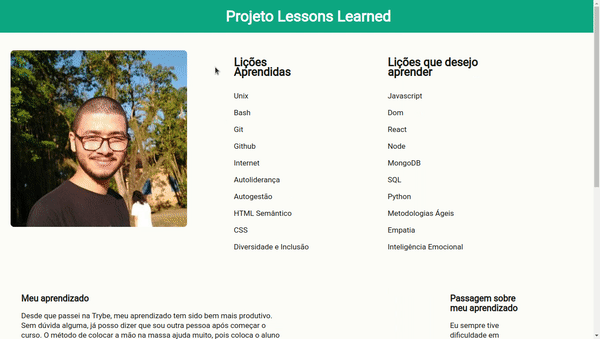
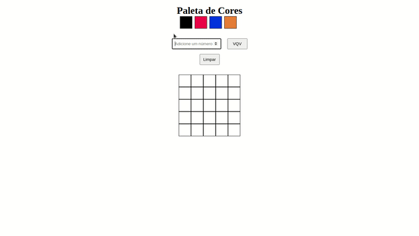
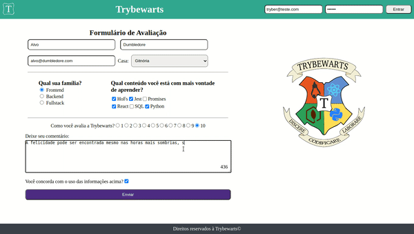

<h1>Fundamentos do Desenvolvimento Web</h1>

    No primeiro módulo, aprendemos conceitos básicos de programação. Desde HTML Semântico à Jest e Higher Order Functions.  

Confira abaixo os projetos desenvolvidos durante todo o módulo de Fundamentos! 🤓

### Lessons Learned

    O lessons learned foi o primeiro projeto desenvolvido no curso da Trybe. O objetivo era criar uma página usando somente HTML e CSS, tomando cuidado com  a semântica para que fosse acessível e melhor ranqueado.

### Pixels-art

    O pixels-art consistia em criar uma página web com uma paleta de cores funcional e que poderia ser utilizada para criar desenhos com pixels. Foi feito com html, css e javascript.

### Trybewarts

    O objetivo do Trybewarts era criar uma página de formulário da Escola de Magia de Trybewarts. O tema é baseado na obrea "Harry Potter", de J. K, Rowling, já que programar é o mais próximo que podemos chegar de algo verdadeiramente mágico!

